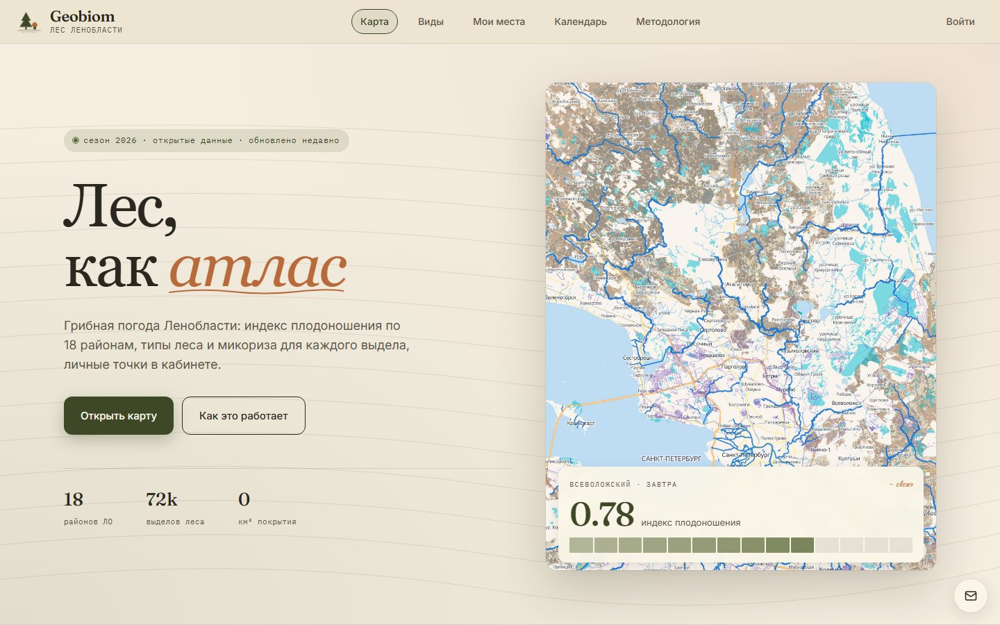
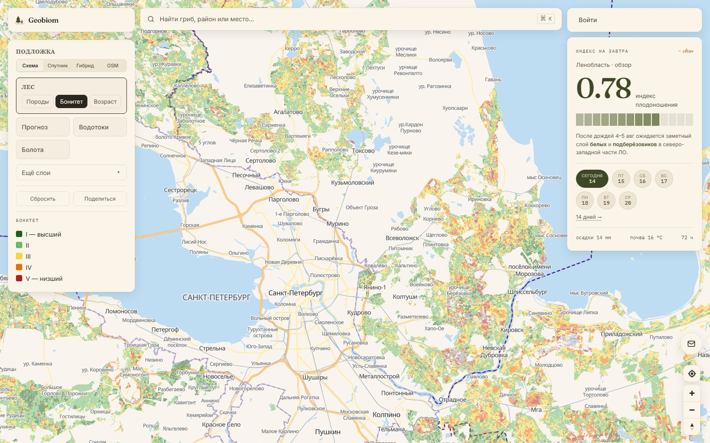
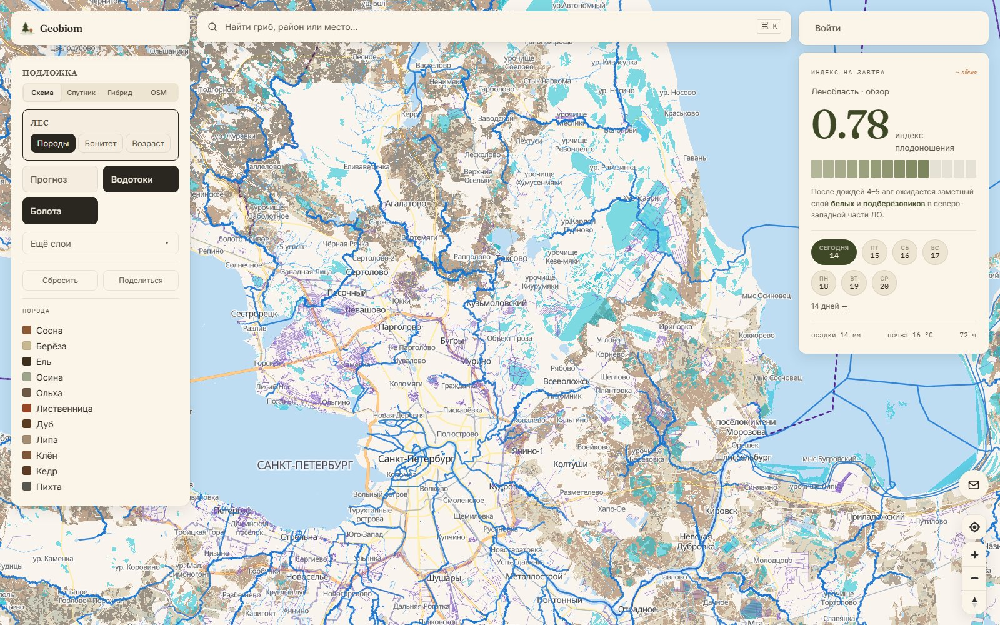

# Geobiom — лес Ленобласти как атлас

Открытый некоммерческий проект про лес Ленинградской области: интерактивная
карта 1.2 млн выделов с породой, бонитетом и возрастом, индекс плодоношения
по 18 районам, личные грибные точки в кабинете.

**Live:** [geobiom.ru](https://geobiom.ru/) · _mirror:_ [app.geobiom.ru](https://app.geobiom.ru/)



---

## Что внутри

Карта раскрашена по реальным данным Рослесхоза/ФГИС ЛК (порода, бонитет,
возраст), поверх — слои воды, болот, ООПТ, лесных дорог и админ-границ.
Клик по выделу открывает список грибов, которые теоретически с этой
породой образуют микоризу. В кабинете — личные точки сбора со рейтингом
и тегами.

<table>
  <tr>
    <td width="50%"></td>
    <td width="50%"></td>
  </tr>
  <tr>
    <td><sub><b>Бонитет</b> — продуктивность древостоя от I (тёмно-зелёный, лучший) до V (красный, низший). Шкала Орлова.</sub></td>
    <td><sub><b>Породы</b> — доминирующая порода: сосна / ель / берёза / осина / ольха / дуб / смешанный лес.</sub></td>
  </tr>
</table>

### Слои карты

13 слоёв с собственными PMTiles (range-запросы напрямую из браузера):

| Слой | Источник | Размер |
|---|---|---|
| **Леса** (порода / бонитет / возраст / прогноз) | Рослесхоз / ФГИС ЛК | 41 MB |
| Водоохранные зоны | ФГИС ЛК | 6 MB |
| ООПТ | OSM Overpass | 1 MB |
| Лесные дороги (OSM) | OSM Overpass | 31 MB |
| Болота | OSM Overpass | 20 MB |
| Линейные водотоки (реки/ручьи) | OSM Overpass | 41 MB |
| Вырубки и гари | ФГИС ЛК | 6 MB |
| Защитные леса | ФГИС ЛК | 14 MB |
| Почвенные зоны | Докучаевский ин-т (ЕГРПР, 1:2.5М) | 2 MB |
| Рельеф (hillshade) | Copernicus GLO-30 DEM | 453 MB |
| 18 районов ЛО | OSM Overpass (level=6) | 0.7 MB |
| Населённые пункты | OSM + Natasha NER | 21 k записей |
| Личные точки | пользовательские | приватный слой |

### Прогноз грибного сезона

Index плодоношения по 18 районам строит сестринский ML-репо
[`mushroom-forecast`](https://github.com/yungkocherov/mushroom-forecast)
(private). Сейчас живёт детерминированный hash-baseline; iter-11 hybrid
модель (LightGBM unified clim_w28 v4 + per-group v5+Optuna small) подключится
к `forecast.prediction` в iter-12. Сигнал из 69 k VK-постов сообщества
`grib_spb`: текст → Natasha NER + regex pump → район → группа гриба →
обучающая выборка.

---

## Стек

**Хранилище** PostgreSQL 16 + PostGIS, две схемы — `public.*` для гео-данных
mushroom-map, `forecast.*` для весовых результатов sister-репо.
**Бэкенд** Python 3.14 + FastAPI + psycopg3.
**Фронтенд** React 19 + TypeScript + Vite + MapLibre GL JS + Zustand +
Radix UI + Fraunces / Inter / IBM Plex Mono.
**Тайлы** PMTiles (HTTP Range), сборка через `pmtiles.writer` (нативный
Python для большинства слоёв) и tippecanoe (для леса с coalesce-densest-as-needed).
**Mobile (отдельный voile)** React Native + Expo bare + maplibre-react-native,
Android-first (RuStore + APK).
**Deploy** Docker Compose + Caddy на двух VM (TimeWeb primary RU, Oracle Stockholm
foreign replica). Nightly pg_dump → age → R2 backup. Daily DB-sync TimeWeb→Oracle.

---

## Архитектура

```
mushroom-map/
├── apps/
│   ├── web/                # React SPA: routes/, components/, store/ (Zustand)
│   └── mobile/             # React Native + Expo (отдельный README)
├── services/
│   ├── api/                # FastAPI: /api/forest, /api/species, /api/cabinet, /tiles/
│   ├── geodata/            # ForestSource ABC (OSM, Copernicus, Rosleshoz)
│   ├── placenames/         # NER топонимов (Natasha) + газеттир
│   ├── species_registry/   # справочник видов (yaml → sql)
│   └── observability/      # GlitchTip Sentry + Umami self-hosted
├── packages/
│   ├── tokens/             # design tokens — палитра/типографика, общая web+mobile
│   ├── types/              # shared TS types (UserSpot, spotTags, etc.)
│   └── api-client/         # типизированный fetch-клиент
├── db/migrations/          # 040+ миграций PostGIS
├── pipelines/              # ETL: ingest_forest, scrape_fgislk, build_*_tiles, extract_vk_districts
├── scripts/
│   ├── deploy/             # two-stack runbooks + systemd units
│   └── backup/             # age + rclone + restore_drill
├── infra/                  # Caddyfiles for prod
├── docs/                   # architecture, redesign plans, data analyses
└── .github/workflows/      # CI: tests + deploy-api + deploy-web (matrix TimeWeb/Oracle)
```

Подробнее:
- [`docs/architecture.md`](docs/architecture.md) — поток данных и контракты
- [`docs/redesign-2026-05/plan.md`](docs/redesign-2026-05/plan.md) — последний редизайн (D1 v2 «лес как атлас»)
- [`docs/mobile-app-2026-05.md`](docs/mobile-app-2026-05.md) — мобильное приложение
- [`scripts/deploy/README.md`](scripts/deploy/README.md) — runbook двух-стека и DB-sync systemd
- [`scripts/backup/README.md`](scripts/backup/README.md) — backup pipeline

---

## Данные

### Лес: Рослесхоз / ФГИС ЛК

~1.23 млн выделов всей Ленинградской области через публичный WMS-Geoserver
ФГИС Лесного Комплекса. Атрибутика: dominant_species, species_composition
(JSONB с долями), бонитет (I-V), возрастная группа (молодняки / средневозрастные
/ приспевающие / спелые / перестойные), запас древесины (m³/га).

Скрапер `pipelines/scrape_fgislk_attrinfo.py` гонит batch'ами через ФГИС
WMS GetFeatureInfo с sanity-check на bogus inflate / cross-batch dups /
quarter-fill gaps. Подробный анализ источников и калибровка качества —
[`docs/forest_sources_analysis.md`](docs/forest_sources_analysis.md).

### VK-сигнал: 69 k постов из `grib_spb`

Пост → Qwen-3.5 9B (LM Studio local) → доли видов на фото → район через
Natasha NER + regex pump. 60.2 % постов с район-атрибуцией. Текущий
покрытый период: 2018–2026, 13 группа-кластеров видов. Используется в
sister-репо как target signal для модели.

### Внешние слои

OSM (Overpass) для дорог / болот / водотоков / ООПТ / населённых пунктов.
Copernicus GLO-30 DEM для рельефа (81 тайл → mosaic UTM 36N → hillshade
PMTiles). EGRPR (Докучаевский ин-т) для почвенной зональности.

---

## Лицензия и кредиты

**Код:** TBD (планируется AGPL-3.0 или MIT после стабилизации API).

**Данные:**
- Лесная инвентаризация — [Рослесхоз / ФГИС ЛК](https://lk.rosleshoz.gov.ru/), открытые данные.
- OSM-слои — © [OpenStreetMap contributors](https://www.openstreetmap.org/copyright), ODbL.
- DEM — [Copernicus GLO-30](https://spacedata.copernicus.eu/), ESA / EU.
- Почвенная карта — Докучаевский ин-т, [ЕГРПР](https://egrpr.esoil.ru/), 1:2.5М.
- Метеоданные — [Open-Meteo](https://open-meteo.com/), CC-BY 4.0.

**Авторство и contact:** Иван Кочеров,
[ikocherov1111@gmail.com](mailto:ikocherov1111@gmail.com).
Обратная связь по сайту — кнопка-конверт в правом нижнем углу
[geobiom.ru](https://geobiom.ru/).
